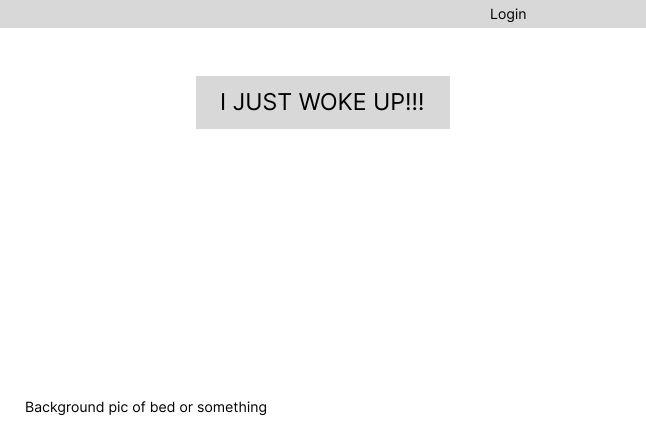
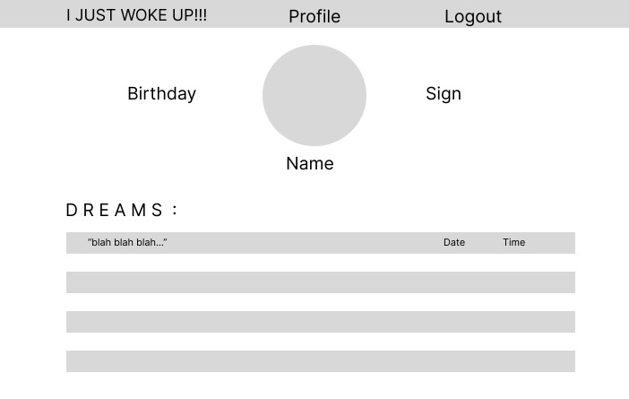
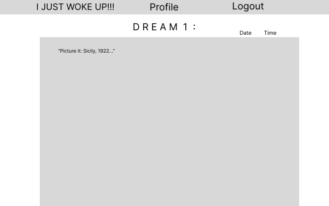

# Project 2

# Dreaming / Bedtime / If Only

## Date: 5/25/23

### By: Cody Garcia

[www.codyrgarcia.com](https://www.codyrgarcia.com/)

[@popgoesthecultureshock](https://www.instagram.com/popgoesthecultureshock/)

---

### **_Description_**

"I had the coolest dream last night!"
"Oh yeah?? What happened??"
"Yeah! Uh-... You were in it.. ... We- I don't remember but it was cool."

"I know there's a writers strike going on, but I'm having my best ideas right now!"
"Ooh! Tell me one!"
"-... Wait what was it...? The other day-. It was a million dollar idea! Godzilla vs Superma-? No..."

"I have to make another project for the software engineering cohort."
"Could never be me. What's your idea for this one?"
"I don't really know yet."

DREAMING exists for the Dreamer that wakes up and wants to record their ideas...their dreams...their fantasies. Whatever! We're not here to judge.

Open the DREAMING home page and right away you'll see the "I JUST WOKE UP" button. Click that, and it immediately takes you to a blank oage where you can word vomit whatever you want. A dream you just woke up from, an idea for an app you just had, a new poem or just to write a little bit every day.
Upon completion, select the type of dream from the five different types in the dream scale (Normal, Day, Lucid, False Awakening, and Nightmare), and input the date and time at the bottom. With a DREAMING profile, you will be be taken to your Dreams page. This contatins all the dreams you've typed out, organized by Time. Make some typos? Wanna shift things around? Edit each journal entry! Not feeling one anymore and it's cluttering up your space? Delete it!
You don't even have to be logged in to input your word vomit. Click the "I JUST WOKE UP" button from the home page and let it all come out! Just be sure to log in after so that it can be saved.
Incase inspiration strikes at any moment, the "I JUST WOKE UP" button will be available on every page, waiting to lead you to your destiny.

Be on the lookout for the BEDTIME update. Input the time you are planning on going to sleep, and we will alert you an hour before that to get off your phone! Preserve a good nights dream with a clear head and be notified to stop looking at your screen!
This will happen whenever Cody learns how to do it.

---

### **_On The Day_**

"It's the day of the show y'all." -Libby Mae Brown

- The home page will have the "I JUST WOKE UP" button front and center. I'm thinking in the shap of a pillow that is on a bed. Perhaps the shape of a journal on a nightstand next to a bed. Otherwise, it will be featured in the NAV bar.

- You can input dreams on a blank page, emulating a sheet of paper in a journal, or a thought bubble a la Calvin and Hobbes.

- Upon completing your entry, be taken to your Profile/All Dreams page. You profile will have your name, birthday and a profile photo. There will also include the featured list of dreams.This has the list of every entry organized by Time. Click on any one to be taken to that individual word vomit. There will be an edit button and a delete button featured at the top right of the entry. If delete is clicked, and "Are you sure?" message will appear.

- The style of this site will be somewhat old fashioned. Think back to 2004, 2003, maybe even 1999. A gray cubistic type world or a cushy blue one to subconsiously remind the User about how far dreams can come.

### **_Wireframes_**

### **_Screenshots_**

### **_Source Photos_**

- [x] README
- [] Pseudocode
- [x] Wireframing
- [x] Trello

**_Credits_**

[FIGMA](www.figma.com)

Images:

[carolineeleanor.com](http://www.carolineeleanor.com/)

[freepik.com](https://www.freepik.com/free-vector/cloudy-night-sky-with-stars-watercolor-background_15316960.htm)

[Markdown Guide](https://ia.net/writer/support/general/markdown-guide)

[Markdown Cheat Sheet](https://www.markdownguide.org/cheat-sheet/)
